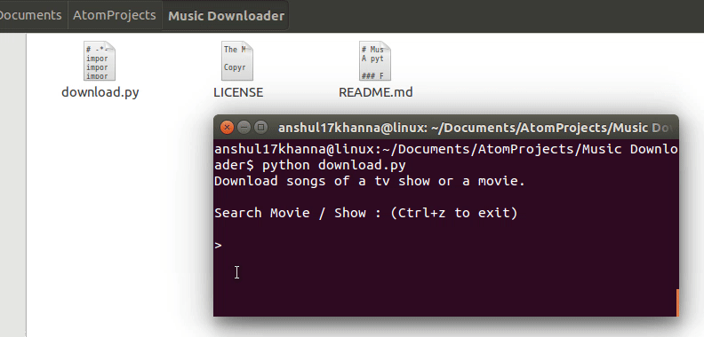

# Music-Downloader
A python script to download songs of a movie or a tv show from command line terminal.

### Features

* Search for similar movie or tv show names

* Fast downloading

* Extremely quick and easy to use


### Requirements

* **Youtube-dl**

For UNIX users (Linux, OS X, etc.):
```
$ sudo wget https://yt-dl.org/downloads/latest/youtube-dl -O /usr/local/bin/youtube-dl
$ sudo chmod a+rx /usr/local/bin/youtube-dl
```

For Windows users, [download this.](https://yt-dl.org/downloads/2016.07.22/youtube-dl.exe)


*  **Python 2.7**

Check official docs to [download Python 2.7](https://www.python.org/downloads/)


*  **Beautiful Soup**
```
$ pip install beautifulsoup4
```


*  **urllib2**
```
$ pip install urllib2
```


### Demo
<div align="center"></div>


### License
MIT © Anshul Khanna